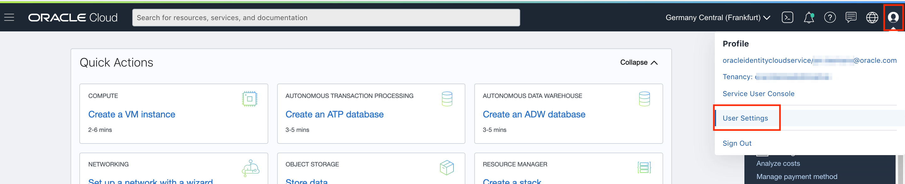
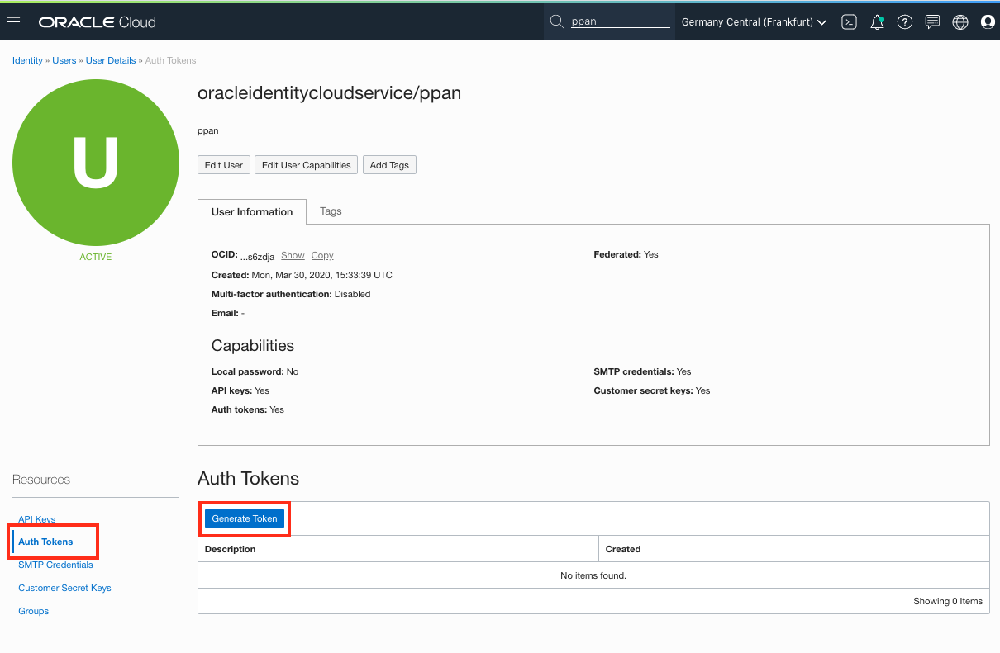
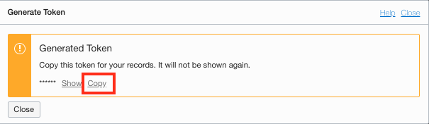
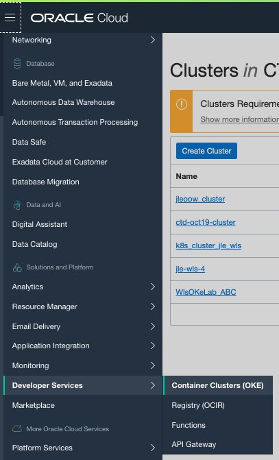
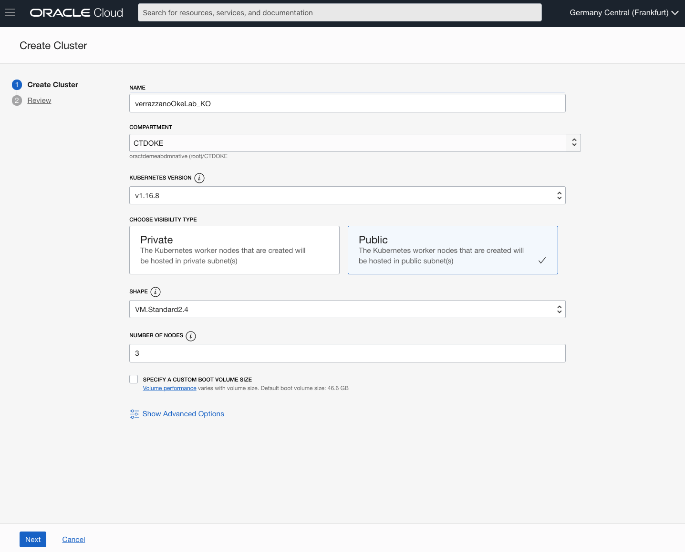
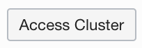

# Running Verrazano on Kubernetes

## Introduction
<Insert introduction>

## Prerequisites

To run these labs you will need access to an Oracle Cloud Tenancy, either via a **Free Tier**, using a **Pay-as-you-Go** account, or using the **Corporate account** of your organization. 

If you do not have an account yet, you can obtain an Oracle Free Tier account by [clicking here.](https://myservices.us.oraclecloud.com/mycloud/signup?sourceType=:ow:wb:sh:em::RC_WWMK200517P00003:Vlab_Weblogic_July&intcmp=:ow:wb:sh:em::RC_WWMK200517P00003:Vlab_Weblogic_July)

## 1. Preparing your environment

- Open the [OCI console](https://console.eu-frankfurt-1.oraclecloud.com), log in using the **Single Sign On** menu on the **left** 

Create a token for your user (will be used to login to the docker repository):

- Open your **User Settings** by clicking on the icon on the top right of the console, then select *User Settings* 

- You can now see the details of your user account:

  

- Select **Auth Token** in the left-hand menu, then click the button **Generate Token**.

    - Enter a name for the token

    - Use the **Copy** button to copy the token in your buffer, and **immediately paste it** in a notebook of your choice, you will need this later.

    
    
    ## 2. Setting up a Kubernetes cluster
    
    We will be using an Oracle Cloud Managed Kubernetes cluster to deploy weblogic.
    
    - Navigate to the ***Developer Services***, then ***Container Clusters (OKE)***.
    
      
    
    - Use the **Create Cluster** button, and select the **Quick Create** type of installation
    
    - Click the **Launch Workflow** button to start the configuration
    
    - On the **Create cluster** screen, enter following parameters:
    
        - Name : the name of your cluster.  We will be using the name *verrazzano_OkeLab_(your_initials)* in this tutorial.  Please replace (your_initials) by a 3-letter code, for example Abc
        - Choose the CTDOKE compartment if it is available in the tenancy.
        - Select **Public** worker nodes
        - Choose the shape VM_Standard2.4
        - **Remark**: you might have to check available compute shapes on your tenancy.  You can do this by visualizing the **Service Limits** on the "Administration" , "Tenancy Details" page.
        - Select the **Number of nodes** you want to create in the node pool.  For example you could make this correspond to the number of *Availability Domains* in the *Region* you are using : in Frankfurt this is **3**, in Amsterdam this is **1**.  More details [here](https://docs.cloud.oracle.com/en-us/iaas/Content/General/Concepts/regions.htm).
        - Click the **Next** button to confirm the configuration, then **Create Cluster** to start the creation.
    
      
    
    
      
    
    
    
    Once the cluster is created (the nodes will continue to be created), you can access the button , and copy the command to download the kubeconfig file of your cluster.
    
    This command will look like: 
    
    ```
    oci ce cluster create-kubeconfig --cluster-id ocid1.cluster.oc1.eu-frankfurt-1.aaaaaaymqyweojygcqwinbwg4yw --file $HOME/.kube/config --region eu-frankfurt-1 --token-version 2.0.0
    ```
    
    
    
    - Open the **Cloud Shell** using the button **">_"** in the upper right of the console.
    
    - Execute the command you copied.  Example :
    
      ```
      EXAMPLE ONLY : oci ce cluster create-kubeconfig --cluster-id ocid1.cluster.oc1.eu-frankfurt-1.aaaaaaaaae4wmmjvmzobzmojqmy3dqz4ggntbgcrtqzrvmy4d --file $HOME/.kube/config --region eu-frankfurt-1 --token-version 2.0.0 
      ```
      
    - We will be running this command to validate that the cluster is up and running. Give it some time, generally it takes around 10 minutes before you can see the nodes listed.
    
      ```
      kubectl get nodes
      ```
      
      ```
      NAME        STATUS   ROLES   AGE   VERSION
      10.0.10.2   Ready    node    15h   v1.16.8
      10.0.10.3   Ready    node    15h   v1.16.8
      10.0.10.4   Ready    node    15h   v1.16.8
      ```

## 3. Installing Verrazzano in your OKE cluster


1. First we clone the Verrazzano repo. This has all of the scripts we need to set it up in our OKE cluster.

   ```
   git clone https://github.com/verrazzano/verrazzano.git
   ```

2. We need to set up env variables, keep in mind that they are only alive as long as the session so if you need to reconnect or restart the Cloud Shell during the installation you have to set them again. When setting the ```VERRAZZANO_KUBECONFIG``` variable you need to refer to your .config file. It's usually in ```/home/<user-home-folder-name>/.kube/config```, you can see an example down below.

   ```
   export CLUSTER_TYPE=OKE
   export VERRAZZANO_KUBECONFIG=/home/koucif/.kube/config
   export KUBECONFIG=$VERRAZZANO_KUBECONFIG
   ```

3. Create a secret for OCIR so you can pull private repos

   ```
   kubectl create secret docker-registry ko-ocirsecret \
     --docker-server=fra.ocir.io \
     --docker-username='oractdemeabdmnative/oracleidentitycloudservice/koucif' \
     --docker-password='H1H7]jzugCw<[+q5-d4X' \
     --docker-email='kadday.oucif@oracle.com' 
   
   ```

4. Now we need to install helm and the version must be v3.0.x, v.3.1.x or v3.2.x. To not make it conflict with current versions of helm / upcoming downloads of helm to the later version we'll create a bin directory and refer to it in this lab.

   ```wget https://get.helm.sh/helm-v3.2.0-linux-amd64.tar.gz```

   Unpack it

   ```gunzip helm-v3.2.0-linux-amd64.tar.gz
   gunzip helm-v3.2.0-linux-amd64.tar.gz
   tar -xf helm-v3.2.0-linux-amd64.tar
   ```

   Create a bin directory for it

   ```mkdir $HOME/bin```

   Move the version of helm into that direcory

   ```mv linux-amd64/helm $HOME/bin```

   Edit the profile to include the bin directory

   ```vi $HOME/.bashrc```

   add a line at the end

   ```export PATH=$HOME/bin:$PATH```

   Save it

5. Install Verrazano (this is using xip.io)

   First, we install istio. Script output displays progress.

   ```
      ./1-install-istio.sh
   ```

   Next some open-source components that verrazano relies on

   ``` ./2a-install-system-components-magicdns.sh``` 

   Verrazano operators, admission controlers & such

   ```./3-install-verrazzano.sh```

   For the security of the system, we install key cloak

   ```./4-install-keycloak.sh```

   When we installed, you see the url where we can access the UI - grafana prometheus others

   also see username and passwords set up

   theyre all put in secrets

   some infra has been installed

   Rancher, certmanager & ingress controllers installed

   Istio has been set up


